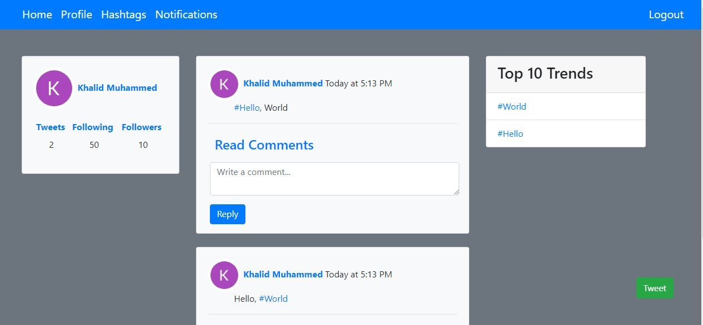

# Twitter

A copy of Twitter that allows users to tweet, reply, create hashtags and follow each others.

Developed using [NodeJs](https://nodejs.org), [ExpressJs](https://expressjs.com/),[MongoDB](https://www.mongodb.com/) for Backend and [Bootstrap](https://getbootstrap.com/) for Frontend.




# Getting Started

first clone this project by running this in terminal

`git clone https://github.com/xerkhalidox/twitter.git`

go to twitter/config and create .env file and create database on MongoDB Atlas more on this [here](https://docs.atlas.mongodb.com/getting-started/)

Create Google developer account and put this on .env file

```
DATABASE_STRING ="Database connection string"
GOOGLE_CLIENT_ID="Your google client id"
GOOGLE_CLIENT_SECRET="your google client secret"
PORT="3000 by default"
```

# Usage

To run the app locally

```
#head to project directory in terminal and run the followig commands
npm install
npm start
```

the app will start at port 3000 by default on this [link](http://localhost:3000/)
